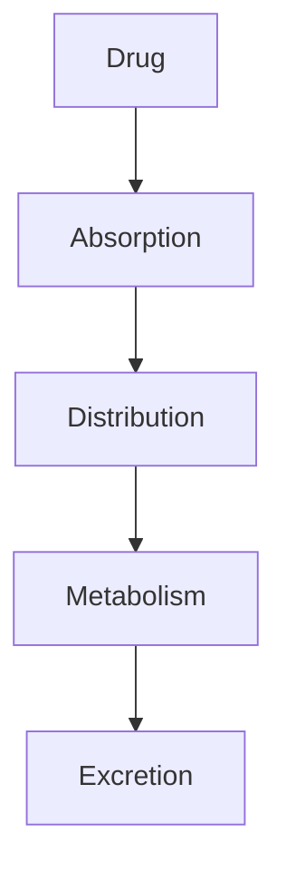
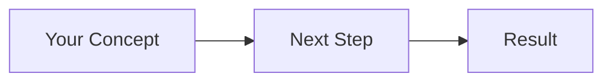

# Pharmacokinetics Obsidian Slides Presentation

## Overview

This is a comprehensive pharmacokinetics lecture presentation designed for **Obsidian.md** with the Advanced Slides plugin. The presentation includes 60+ slides with diagrams, practice problems, and clinical cases.

---

## Quick Start

### 1. Install Obsidian

Download and install Obsidian from: https://obsidian.md/

### 2. Install Advanced Slides Plugin

**Method A - Community Plugins (Recommended):**

1. Open Obsidian
2. Go to **Settings** → **Community plugins**
3. Click **Browse** community plugins
4. Search for "**Advanced Slides**"
5. Click **Install** then **Enable**

**Method B - Manual Install:**

1. Download Advanced Slides from: https://github.com/MSzturc/obsidian-advanced-slides
2. Extract to `.obsidian/plugins/` folder in your vault
3. Enable in Settings → Community plugins

### 3. Open the Presentation

1. Copy `pharmacokinetics_lecture_obsidian.md` to your Obsidian vault
2. Open the file in Obsidian
3. Click the **Start Presentation** button (looks like a screen icon)
   - Or use command palette (Ctrl/Cmd + P) → "Advanced Slides: Show Slide Preview"

### 4. Present!

- Use arrow keys to navigate
- Press **ESC** to exit presentation mode
- Press **?** for help/shortcuts

---

## Features

### Slide Content

✅ **60+ Professional Slides**
- Title and learning objectives
- 5 major sections (ADME, Compartments, Infusion, Bioavailability, Clinical)
- Practice problems with solutions
- Clinical case studies
- Summary and resources

✅ **Visual Elements**
- Mermaid diagrams (ADME, compartment models, flowcharts)
- ASCII art graphs (concentration-time curves)
- Tables and comparisons
- Formula displays with LaTeX

✅ **Interactive Features**
- Incremental reveals (fragments)
- Split-screen layouts
- Tabbed content
- Speaker notes
- Background color transitions for sections

---

## Navigation & Controls

### Basic Navigation

| Key | Action |
|-----|--------|
| **→ or Space** | Next slide |
| **← or Backspace** | Previous slide |
| **↓** | Next vertical slide (if any) |
| **↑** | Previous vertical slide |
| **Home** | First slide |
| **End** | Last slide |
| **ESC** | Exit presentation / Overview mode |

### Advanced Features

| Key/Action | Function |
|------------|----------|
| **?** | Show keyboard shortcuts |
| **F** | Fullscreen mode (browser dependent) |
| **S** | Speaker notes view (if available) |
| **O** | Overview mode (see all slides) |
| **B** or **.** | Blackout/pause screen |
| **Click** | Navigate forward |

### Presenter Mode

Some versions of Advanced Slides support presenter mode:
- Current slide
- Next slide preview
- Speaker notes
- Timer

Check your Advanced Slides version for availability.

---

## Customization

### Changing Theme

Edit the YAML frontmatter at the top of the file:

```yaml
---
theme: white  # Options: white, black, league, beige, sky, etc.
highlightTheme: github  # Code highlighting theme
transition: slide  # Options: slide, fade, convex, zoom
slideNumber: true  # Show slide numbers
---
```

### Available Themes

- **white** - Clean white background (current)
- **black** - Dark background
- **league** - Gray background with blue accent
- **beige** - Warm beige tones
- **sky** - Blue gradient
- **night** - Dark with orange accents
- **serif** - Classic serif fonts
- **simple** - Minimalist

### Modifying Content

The presentation uses standard Markdown with some special syntax:

**Slide Separator:**
```markdown
---
```

**Fragments (Incremental Reveals):**
```markdown
<!-- .element: class="fragment" -->
This appears on click
```

**Split Screen:**
```markdown
<split even>

Left content

|||

Right content

</split>
```

**Speaker Notes:**
```markdown
note:
These are speaker notes
Only visible in presenter mode
```

**Background Colors:**
```markdown
<!-- .slide: data-background="#1a5490" -->
```

### Adding Images

To add local images:

```markdown

```

Or use online images:

```markdown

```

---

## Mermaid Diagrams

The presentation includes several Mermaid flowcharts and diagrams. These render automatically if:

1. **Obsidian has Mermaid support** (built-in)
2. **Advanced Slides supports Mermaid** (most versions do)

**Example Mermaid diagram in presentation:**



If Mermaid diagrams don't render:
- Update Advanced Slides plugin to latest version
- Check Obsidian settings for Mermaid support
- Alternative: Replace with images or ASCII art

---

## LaTeX Math Formulas

The presentation uses LaTeX for mathematical formulas:

```latex
$$V_d = \frac{Dose}{C_0}$$
```

This should render automatically in Obsidian. If not:

1. Check Settings → Editor → Math rendering is enabled
2. Ensure Advanced Slides supports LaTeX (most versions do)
3. Update to latest Obsidian version

**Common formulas in presentation:**
- Volume of distribution: $V_d = Dose / C_0$
- Clearance: $Cl = k \times V_d$
- Half-life: $t_{1/2} = 0.693 / k$
- Steady-state: $C_{ss} = R_0 / Cl$

---

## Exporting

### Export to PDF

**Method 1 - Print to PDF (Recommended):**

1. Start presentation in Obsidian
2. Right-click → Print (or Ctrl/Cmd + P)
3. Select "Save as PDF"
4. Adjust settings:
   - Layout: Landscape
   - Remove headers/footers
5. Save

**Method 2 - Decktape (Advanced):**

Install Decktape CLI tool:
```bash
npm install -g decktape
```

Then export:
```bash
decktape http://localhost:port/presentation.html output.pdf
```

### Export to HTML

Advanced Slides can export standalone HTML:

1. Open command palette (Ctrl/Cmd + P)
2. Search for "Advanced Slides: Export to HTML"
3. Choose location and save

The HTML file can be opened in any browser without Obsidian.

### Export to PowerPoint

**Option 1 - Via PDF:**
1. Export to PDF (see above)
2. Use online converter: PDF → PPTX
3. Recommended: https://www.adobe.com/acrobat/online/pdf-to-ppt.html

**Option 2 - Pandoc (Advanced):**
```bash
pandoc pharmacokinetics_lecture_obsidian.md -o output.pptx
```

Note: May require some formatting adjustments.

---

## Presentation Tips

### Before the Lecture

**Preparation:**
1. ✅ Open presentation in Obsidian
2. ✅ Test slide navigation (→ ← keys)
3. ✅ Check all Mermaid diagrams render
4. ✅ Verify formulas display correctly
5. ✅ Test on presentation equipment (HDMI, projector)
6. ✅ Have backup PDF ready

**Setup:**
- Close unnecessary applications
- Disable notifications
- Set display to "Presenter" mode if using dual monitors
- Adjust Obsidian zoom if needed (Ctrl/Cmd + scroll)

### During the Lecture

**Navigation Tips:**
- Use **Space** for consistent forward movement
- Use **B** to pause/blackout during discussions
- Use **ESC** then click to jump to specific slides
- Speaker notes visible in separate window (if supported)

**Engagement:**
- Pause on practice problems
- Ask questions during fragment reveals
- Use blackout for extended discussions
- Point to diagrams and formulas

**Time Management:**
- ~90 minutes total
- Part 1 (Fundamentals): 20 min
- Part 2 (Compartments): 25 min
- Part 3 (Infusion): 15 min
- Part 4 (Bioavailability): 15 min
- Part 5 (Clinical): 10 min
- Summary & Q&A: 5 min

### After the Lecture

**Share Materials:**
- Export to PDF and share with students
- Share Markdown file if students use Obsidian
- Provide practice problems separately
- Share link to Boomer.org resources

---

## Troubleshooting

### Problem: Presentation Button Not Showing

**Solution:**
- Ensure Advanced Slides plugin is installed and enabled
- Restart Obsidian
- Check file is in Markdown format (.md)
- Try command palette: Ctrl/Cmd + P → "Advanced Slides"

### Problem: Mermaid Diagrams Not Rendering

**Solutions:**
1. Update Obsidian to latest version
2. Update Advanced Slides plugin
3. Check Obsidian Settings → Editor → Enable Mermaid support
4. Alternative: Replace with images

### Problem: Math Formulas Not Rendering

**Solutions:**
1. Settings → Editor → Enable "Math" or "LaTeX"
2. Update Obsidian
3. Check formula syntax (should be `$$formula$$`)

### Problem: Slides Look Wrong

**Solutions:**
1. Check YAML frontmatter is intact
2. Try different theme in frontmatter
3. Update Advanced Slides to latest version
4. Check for syntax errors in Markdown

### Problem: Split Screen Not Working

**Solutions:**
1. Ensure using latest Advanced Slides
2. Check syntax: `<split even>` ... `|||` ... `</split>`
3. Try alternative: Use two-column table
4. Update plugin

### Problem: Can't Export to PDF

**Solutions:**
1. Use browser print to PDF instead
2. Export to HTML first, then print HTML to PDF
3. Use screenshot tool to capture slides
4. Convert via Pandoc

---

## Structure of Presentation

### Slide Organization

**Main Sections:**

1. **Title & Introduction** (Slides 1-2)
   - Title slide
   - Learning objectives

2. **Part 1: Fundamentals** (Slides 3-7)
   - What is pharmacokinetics?
   - ADME processes
   - Concentration-time curves

3. **Part 2: Compartment Models & IV Bolus** (Slides 8-20)
   - One-compartment model
   - Volume of distribution (Vd)
   - Clearance (Cl)
   - Half-life (t½)
   - First-order vs zero-order kinetics
   - Practice problems

4. **Part 3: IV Infusion & Steady State** (Slides 21-26)
   - Continuous infusion
   - Steady-state principles
   - Loading dose concept

5. **Part 4: Oral Administration** (Slides 27-34)
   - Oral vs IV comparison
   - Bioavailability (F)
   - First-pass metabolism
   - Bioequivalence

6. **Part 5: Clinical Applications** (Slides 35-43)
   - Gentamicin case study
   - Special populations
   - Renal/hepatic impairment
   - Elderly and obesity

7. **Summary & Resources** (Slides 44-55)
   - Key concepts
   - Essential formulas
   - Clinical pearls
   - Practice problems
   - Resources

8. **Closing** (Slides 56-60)
   - Questions
   - Quick reference card
   - Contact information

---

## Comparison: Obsidian vs Quarto

You have **both** presentation options available:

### Obsidian Slides

**Pros:**
- ✅ Simple Markdown editing
- ✅ Works offline in Obsidian
- ✅ Easy to customize
- ✅ Quick to present
- ✅ Good for notes and presentation in one tool
- ✅ ASCII art graphs included

**Cons:**
- ❌ Requires Obsidian + plugin
- ❌ Less control over styling
- ❌ No auto-generated R graphs
- ❌ Limited export options

**Best for:**
- Quick presentations
- Obsidian users
- Offline presentations
- Simple, clean slides

### Quarto Presentation (.qmd)

**Pros:**
- ✅ R-generated graphs (publication quality)
- ✅ More styling control
- ✅ Better export options (PDF, PPTX)
- ✅ Professional appearance
- ✅ Interactive R code
- ✅ Web-based (share via link)

**Cons:**
- ❌ Requires R, RStudio, Quarto
- ❌ More complex setup
- ❌ Larger file size
- ❌ Steeper learning curve

**Best for:**
- Academic presentations
- When R graphs are valuable
- Web publishing
- Advanced customization

---

## Enhancing the Presentation

### Adding Your Own Slides

Insert new slide with separator:

```markdown
---

## Your New Slide Title

Your content here...

---
```

### Adding Images from Web

Based on our image research, you can add:

**ADME Diagram:**
```markdown

```

**Concentration-Time Curves:**
```markdown

```

### Creating Custom Diagrams

**Option 1 - Mermaid:**
Already included in presentation. Customize existing or add new:

```markdown

```

**Option 2 - ASCII Art:**
Good for simple graphs:

```markdown
```
Conc
 │  ╱╲
 │ ╱  ╲___
 │╱       ╲___
 └──────────────
   Time
```
```

**Option 3 - External Tools:**
- Create in PowerPoint/Google Slides
- Export as PNG
- Link in presentation

---

## Additional Resources

### Obsidian Resources

- **Official Docs:** https://help.obsidian.md/
- **Community Forum:** https://forum.obsidian.md/
- **Advanced Slides Docs:** https://mszturc.github.io/obsidian-advanced-slides/

### Presentation Content Resources

- **Boomer.org:** https://www.boomer.org/c/p4/syllabus.html
- **NCBI Pharmacokinetics:** https://www.ncbi.nlm.nih.gov/books/NBK595006/
- **Deranged Physiology:** https://derangedphysiology.com/

### Related Files in This Package

- `pharmacokinetics_intro_lecture.qmd` - Quarto version
- `pharmacokinetics_intro_lecture_outline.md` - Detailed notes
- `pharmacokinetics_practice_problems.md` - Student worksheet
- `pharmacokinetics_practice_solutions.md` - Answer key
- `pharmacokinetics_quick_reference.md` - Study guide
- `image_sources_and_links.md` - Image resources

---

## Quick Start Checklist

- [ ] Install Obsidian (https://obsidian.md/)
- [ ] Enable Community Plugins (Settings → Community plugins)
- [ ] Install "Advanced Slides" plugin
- [ ] Copy `pharmacokinetics_lecture_obsidian.md` to vault
- [ ] Open file in Obsidian
- [ ] Click "Start Presentation" button
- [ ] Test navigation with arrow keys
- [ ] Review all slides
- [ ] Check Mermaid diagrams render
- [ ] Check LaTeX formulas display
- [ ] Test on presentation equipment
- [ ] Export backup PDF
- [ ] Print handouts for students

**You're ready to present!** 🎓

---

## Support

### Getting Help

**Obsidian Issues:**
- Check Obsidian documentation
- Visit community forum
- Update to latest version

**Advanced Slides Issues:**
- Check plugin GitHub: https://github.com/MSzturc/obsidian-advanced-slides
- Report bugs on GitHub issues
- Update plugin to latest version

**Content Questions:**
- Review detailed lecture outline
- Consult Boomer.org resources
- Check NCBI references

### Feedback

This presentation is based on:
- Boomer.org PHAR 7632 Syllabus
- Introductory pharmacokinetics curriculum
- Educational best practices

Feel free to:
- Customize for your audience
- Add institution-specific content
- Share improvements with teaching community

---

**Version:** 1.0
**Last Updated:** 2025-11-14
**Format:** Obsidian Markdown with Advanced Slides
**Duration:** 90 minutes
**Slides:** 60+

**Happy Presenting!** 🎉
