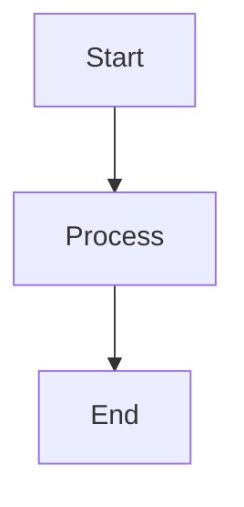

# Pharmacokinetics Introduction Lecture - Quarto Presentation

## Overview

This is a comprehensive 90-minute lecture presentation on introductory pharmacokinetics, created with Quarto/RevealJS. The presentation includes:

- 30+ slides with detailed content
- Interactive R-generated graphs
- Mermaid diagrams for concepts
- Practice problems with solutions
- Clinical case examples
- Links to external image resources
- Speaker notes

## Files Included

1. **pharmacokinetics_intro_lecture.qmd** - Main Quarto presentation file
2. **custom.css** - Custom styling for the presentation
3. **pharmacokinetics_intro_lecture_outline.md** - Detailed lecture notes
4. **pharmacokinetics_practice_problems.md** - Student worksheet
5. **pharmacokinetics_practice_solutions.md** - Answer key
6. **pharmacokinetics_quick_reference.md** - Study guide

## Prerequisites

### Required Software

1. **R** (version 4.0 or higher)
   ```bash
   # Install R from https://www.r-project.org/
   ```

2. **RStudio** (recommended) or any R-compatible IDE
   ```bash
   # Download from https://posit.co/downloads/
   ```

3. **Quarto** (version 1.3 or higher)
   ```bash
   # Download from https://quarto.org/docs/get-started/
   ```

### Required R Packages

Install the following R packages:

```r
# In R or RStudio console:
install.packages("ggplot2")      # For graphs
install.packages("dplyr")         # For data manipulation
install.packages("knitr")         # For rendering
install.packages("rmarkdown")     # For markdown support
```

## How to Render the Presentation

### Option 1: Using RStudio (Easiest)

1. Open `pharmacokinetics_intro_lecture.qmd` in RStudio
2. Click the "Render" button at the top of the editor
3. The presentation will open in your browser

### Option 2: Using Command Line

```bash
# Navigate to the directory containing the .qmd file
cd /path/to/presentation

# Render the presentation
quarto render pharmacokinetics_intro_lecture.qmd

# Or to render and preview:
quarto preview pharmacokinetics_intro_lecture.qmd
```

### Option 3: Using R Console

```r
# In R console:
quarto::quarto_render("pharmacokinetics_intro_lecture.qmd")
```

## Output

The rendering process will create:

- **pharmacokinetics_intro_lecture.html** - The main presentation file
- **pharmacokinetics_intro_lecture_files/** - Supporting files and images

## Viewing the Presentation

### In Browser

1. Open the generated `.html` file in any modern web browser:
   - Chrome (recommended)
   - Firefox
   - Safari
   - Edge

2. Use keyboard shortcuts:
   - **Arrow keys** or **Space**: Navigate slides
   - **F**: Enter fullscreen mode
   - **S**: Open speaker notes view
   - **O** or **Esc**: Overview mode (see all slides)
   - **B**: Blackout screen
   - **C**: Enable chalkboard (drawing mode)
   - **?**: Show keyboard shortcut help

### Presenter Mode

1. Press **S** to open speaker view
2. Shows:
   - Current slide
   - Next slide preview
   - Speaker notes
   - Timer

## Customization

### Modifying Content

Edit the `.qmd` file to:

- Add/remove slides
- Modify text and formulas
- Change graphs and diagrams
- Update practice problems

### Changing Appearance

Edit `custom.css` to customize:

- Colors and fonts
- Slide layouts
- Table styling
- Callout box appearance

### Modifying Theme

In the YAML header of the `.qmd` file, you can change:

```yaml
format:
  revealjs:
    theme: [serif, moon, sky, beige, etc.]
    transition: [slide, fade, convex, etc.]
```

## Using Images

### External Images Referenced

The presentation includes links to educational images:

1. **ADME Diagrams:**
   - ResearchGate: ADME processes diagram
   - NCBI: Pharmacokinetics illustrations

2. **Concentration-Time Curves:**
   - ScienceDirect: Plasma concentration curves
   - ResearchGate: Oral and IV administration

3. **First-Pass Metabolism:**
   - ResearchGate: First-pass and bioavailability diagram

4. **Kinetics Comparisons:**
   - NCBI: First-order vs zero-order kinetics

### Adding Your Own Images

To include local images:

```markdown

```

Or with size control:

```markdown
{width=80%}
```

## Interactive Features

### R Code Chunks

The presentation includes R code that generates:

- Concentration-time curves
- Comparison graphs
- Bar charts for clearance

These are rendered automatically when you render the presentation.

### Mermaid Diagrams

Flow charts and diagrams are created using Mermaid syntax:



### Incremental Lists

Use `{.incremental}` to reveal list items one at a time:

```markdown
::: {.incremental}
- First item
- Second item
- Third item
:::
```

## Exporting

### PDF Export

To create a PDF version:

```bash
quarto render pharmacokinetics_intro_lecture.qmd --to pdf
```

Or use browser print function:

1. Open presentation in browser
2. Add `?print-pdf` to URL
3. File → Print → Save as PDF

### PowerPoint Export

```bash
quarto render pharmacokinetics_intro_lecture.qmd --to pptx
```

### Static Handout

For a printable version without animations:

```bash
quarto render pharmacokinetics_intro_lecture.qmd --to html --no-self-contained
```

## Troubleshooting

### Common Issues

**1. "Package 'ggplot2' not found"**
```r
install.packages("ggplot2")
```

**2. "Quarto command not found"**
- Ensure Quarto is installed and in your PATH
- Restart your terminal/RStudio after installation

**3. Graphs not rendering**
- Check that R packages are installed
- Verify R is accessible from command line: `R --version`

**4. Mermaid diagrams not showing**
- Ensure you have internet connection (Mermaid needs to load)
- Or install mermaid-cli locally

**5. Custom CSS not applying**
- Check that `custom.css` is in the same directory
- Verify the path in YAML header is correct

### Getting Help

If you encounter issues:

1. Check Quarto documentation: https://quarto.org/docs/presentations/revealjs/
2. R package documentation: `?ggplot2`
3. RevealJS documentation: https://revealjs.com/

## Presentation Tips

### Before the Lecture

1. **Test the presentation:**
   - Render and view entire presentation
   - Check all graphs display correctly
   - Verify speaker notes are accessible (press S)

2. **Prepare equipment:**
   - Test projector/screen resolution
   - Have backup PDF version
   - Test internet connection (for external links)

3. **Review materials:**
   - Print handout (pharmacokinetics_quick_reference.md)
   - Print practice problems
   - Have calculator ready for live calculations

### During the Lecture

1. **Navigation:**
   - Use arrow keys or click to advance
   - Use overview mode (O) to jump to specific slides
   - Use blackout (B) if needed for discussions

2. **Interactive elements:**
   - Pause for incremental reveals
   - Ask questions during fragments
   - Use chalkboard (C) to annotate slides

3. **Time management:**
   - Use speaker view timer (S)
   - Each major section ~15-20 minutes
   - Leave 5-10 minutes for questions

### After the Lecture

1. **Share materials:**
   - Upload HTML to learning management system
   - Share PDF version for offline viewing
   - Distribute practice problems

2. **Gather feedback:**
   - Student understanding of concepts
   - Technical issues with presentation
   - Suggested improvements

## Advanced Features

### Adding Videos

Embed videos directly:

```markdown

```

### Adding Polls

Use Mentimeter or Poll Everywhere:

```markdown
<iframe src="POLL_URL" width="100%" height="600px"></iframe>
```

### Two-Column Layouts

```markdown
::: {.columns}
::: {.column width="50%"}
Left content
:::
::: {.column width="50%"}
Right content
:::
:::
```

### Custom Animations

Add custom transitions:

```markdown
::: {.fragment .fade-in}
This fades in
:::

::: {.fragment .fade-out}
This fades out
:::

::: {.fragment .highlight-blue}
This highlights in blue
:::
```

## Image Sources & Attribution

All image links in the presentation reference:

- **ResearchGate:** Open access scientific diagrams
- **NCBI/PMC:** Public domain medical illustrations
- **Educational websites:** Creative Commons licensed content

When using this presentation:

- Maintain attribution links
- Check individual image licenses
- Add institutional logo if desired

## Boomer.org Integration

The presentation is based on:

- **Boomer.org PHAR 7632 Syllabus**
- Website: https://www.boomer.org/c/p4/
- Created by Dr. David Bourne

Direct chapter links included in slides:

- Chapter 3: Fundamentals
- Chapter 4: IV Bolus
- Chapter 5: Parameters
- Chapter 6: IV Infusion
- Chapters 7-8: Oral Administration

## License & Usage

This presentation is educational material based on publicly available pharmacokinetics resources.

**Permitted uses:**

- Academic teaching
- Student education
- Clinical training
- Personal study

**Please:**

- Maintain attribution to Boomer.org
- Keep resource links intact
- Share improvements with teaching community

## Version History

- **Version 1.0** (2025-11-12): Initial release
  - 30+ slides
  - R-generated graphs
  - Mermaid diagrams
  - Practice problems included

## Contact

For questions or improvements to this presentation:

- Review the detailed lecture outline (pharmacokinetics_intro_lecture_outline.md)
- Check the quick reference guide (pharmacokinetics_quick_reference.md)
- Consult Boomer.org for additional resources

---

## Quick Start Checklist

- [ ] Install R and required packages
- [ ] Install Quarto
- [ ] Download all presentation files
- [ ] Render presentation: `quarto render pharmacokinetics_intro_lecture.qmd`
- [ ] Open HTML file in browser
- [ ] Test speaker mode (press S)
- [ ] Review all slides
- [ ] Print handouts for students
- [ ] Test on presentation equipment

**Ready to teach!** 🎓
