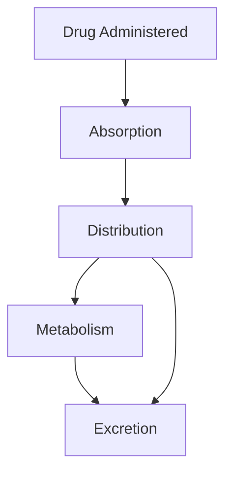
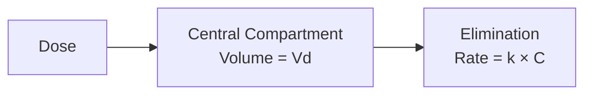
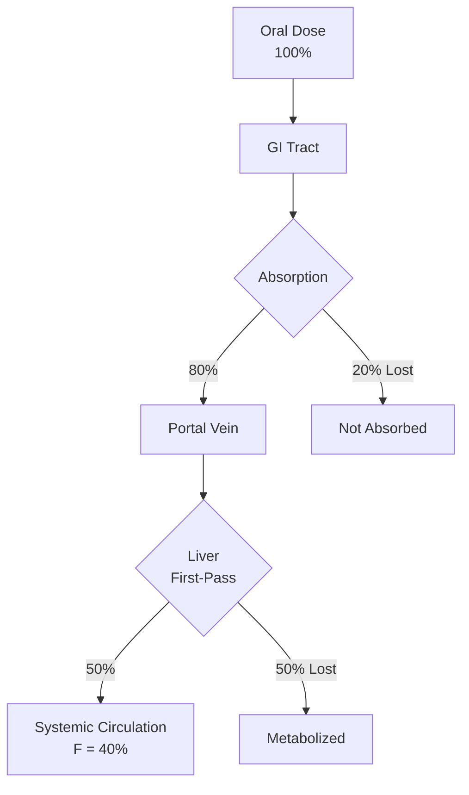

# Image Sources and Links for Pharmacokinetics Presentation

This document contains all the image sources referenced in the presentation, with direct links and suggestions for downloading or creating visuals.

---

## 1. ADME (Absorption, Distribution, Metabolism, Excretion) Diagrams

### Recommended Sources:

**Source 1: ResearchGate - ADME Schematic**
- **Link:** https://www.researchgate.net/figure/Schematic-diagram-showing-the-four-pharmacokinetic-processes-absorption-distribution_fig1_334629263
- **Description:** Clear schematic showing the four pharmacokinetic processes
- **Usage:** Slide 3 - ADME Fundamentals
- **How to use:**
  - Visit link and download high-resolution image
  - Or screenshot and save as `adme_diagram.png`

**Source 2: ResearchGate - ADME Processes**
- **Link:** https://www.researchgate.net/figure/The-ADME-processes-shown-schematically_fig1_282667626
- **Description:** Another clear ADME flowchart
- **Alternative:** Can be used instead of Source 1

**Source 3: NCBI Bookshelf**
- **Link:** https://www.ncbi.nlm.nih.gov/books/NBK595006/
- **Description:** Chapter on Pharmacokinetics & Pharmacodynamics with figures
- **License:** Public domain (NCBI content)
- **Contains:** Multiple PK diagrams and illustrations

### DIY Alternative:

Create your own using the Mermaid diagram already in the presentation (Slide 2):



**Save as:** Take screenshot of rendered diagram

---

## 2. Concentration-Time Curves

### Recommended Sources:

**Source 1: ResearchGate - Oral Administration**
- **Link:** https://www.researchgate.net/figure/Plasma-level-time-curve-for-a-drug-administered-by-oral-route_fig2_295703806
- **Description:** Classic plasma concentration-time curve for oral drug
- **Shows:** Cmax, Tmax, absorption and elimination phases
- **Usage:** Slide 4 - Concentration-Time Relationship

**Source 2: ResearchGate - IV Infusion**
- **Link:** https://www.researchgate.net/figure/Plasma-concentration-time-curve-after-IV-Infusion_fig7_295703806
- **Description:** Shows rise to steady-state during IV infusion
- **Usage:** Slide 12 - Continuous IV Infusion

**Source 3: ScienceDirect Topics**
- **Link:** https://www.sciencedirect.com/topics/biochemistry-genetics-and-molecular-biology/plasma-concentration-time-curve
- **Description:** Overview page with multiple concentration-time curve examples
- **Contains:** IV bolus, oral, infusion examples

**Source 4: IntechOpen**
- **Link:** https://www.intechopen.com/chapters/49459
- **Title:** "Pharmacokinetics of Drugs Following IV Bolus, IV Infusion, and Oral Administration"
- **Description:** Comprehensive chapter with multiple figures
- **License:** Open access

**Source 5: Wikipedia AUC**
- **Link:** https://en.wikipedia.org/wiki/Area_under_the_curve_(pharmacokinetics)
- **Description:** Explains AUC with diagrams
- **License:** Creative Commons

### DIY Alternative:

Use the R-generated graphs already in the presentation! They are automatically created when you render the .qmd file.

**To save as standalone images:**

```r
# In R:
library(ggplot2)

# Generate concentration-time curve
time <- seq(0, 24, by = 0.1)
C0 <- 100
k <- 0.139
conc <- C0 * exp(-k * time)

df <- data.frame(time = time, concentration = conc)

p <- ggplot(df, aes(x = time, y = concentration)) +
  geom_line(color = "darkblue", size = 1.2) +
  labs(title = "IV Bolus: Concentration-Time Curve",
       x = "Time (hours)",
       y = "Concentration (mg/L)") +
  theme_minimal()

# Save
ggsave("concentration_time_iv.png", p, width = 8, height = 6, dpi = 300)
```

---

## 3. One-Compartment Model Diagrams

### Recommended Sources:

**Source 1: Boomer.org Chapter 4**
- **Link:** https://www.boomer.org/c/p4/c04/c04.pdf
- **Description:** Official course material with compartment diagrams
- **Contains:** Detailed schemes for IV bolus administration
- **License:** Educational use
- **Usage:** Slide 6 - Compartment Models

**Source 2: Deranged Physiology**
- **Link:** https://derangedphysiology.com/main/cicm-primary-exam/pharmacokinetics/Chapter-201/single-and-multiple-compartment-models-drug-distribution
- **Description:** Excellent educational resource with clear diagrams
- **Contains:** Single and multiple compartment models
- **Visual style:** Hydraulic model analogies

**Source 3: rxkinetics.com**
- **Link:** https://rxkinetics.com/pktutorial/1_5.html
- **Description:** Interactive PK tutorial
- **Contains:** Compartment model diagrams and explanations

**Source 4: Purdue Cyto**
- **Link:** http://www.cyto.purdue.edu/cdroms/cyto2/17/pkinet/one-com.htm
- **Description:** One compartment model explanation with diagram

### DIY Alternative:

Use the Mermaid diagram in the presentation (Slide 6):



**Enhancement:** You can also use PowerPoint or Google Slides to create a simple box diagram.

---

## 4. Bioavailability and First-Pass Metabolism

### Recommended Sources:

**Source 1: ResearchGate - First-Pass Concept**
- **Link:** https://www.researchgate.net/figure/The-concept-of-first-pass-metabolism-and-bioavailability-modified-from-Rowland-Tozer_fig3_33935609
- **Description:** Classic diagram from Rowland & Tozer
- **Shows:** How first-pass metabolism affects bioavailability
- **Usage:** Slide 15 - Bioavailability

**Source 2: NCBI StatPearls - First-Pass Effect**
- **Link:** https://www.ncbi.nlm.nih.gov/books/NBK551679/
- **Description:** Comprehensive article on first-pass effect
- **License:** Public domain
- **Contains:** Explanatory diagrams

**Source 3: Tulane PharmWiki**
- **Link:** https://tmedweb.tulane.edu/pharmwiki/doku.php/bioavailability_the_first_pass_effect
- **Description:** Educational resource with figures
- **Contains:** "Figure 1 Bioavailability reflects the fraction of drug absorbed..."

**Source 4: Wikipedia First-Pass Effect**
- **Link:** https://en.wikipedia.org/wiki/First_pass_effect
- **Description:** Overview with diagrams
- **License:** Creative Commons

**Source 5: JOVE Science Education Video**
- **Link:** https://www.jove.com/science-education/v/15007/first-pass-effect
- **Description:** Video explaining first-pass effect
- **Contains:** Animated diagrams

### DIY Alternative:

Use the Mermaid diagram in Slide 15:



---

## 5. First-Order vs Zero-Order Kinetics

### Recommended Sources:

**Source 1: NCBI StatPearls**
- **Link:** https://www.ncbi.nlm.nih.gov/books/NBK499866/
- **Title:** "Physiology, Zero and First Order Kinetics"
- **Description:** Clear explanation with comparison graphs
- **License:** Public domain
- **Usage:** Slide 10 - Kinetics Comparison

**Source 2: Deranged Physiology**
- **Link:** https://derangedphysiology.com/main/cicm-primary-exam/pharmacokinetics/Chapter-337/first-order-zero-order-and-non-linear-elimination-kinetics
- **Description:** Detailed comparison with graphs
- **Contains:** Linear vs semi-log plots

**Source 3: ABC of PK/PD (Open Education Alberta)**
- **Link:** https://pressbooks.openeducationalberta.ca/abcofpkpd/chapter/cc15-first-and-zero-order-kinetics/
- **Description:** Open textbook with clear diagrams
- **License:** Creative Commons

**Source 4: SlideShare Presentation**
- **Link:** https://www.slideshare.net/slideshow/kinetics-of-elimination-first-order-and-zero-order-kinetics/275987916
- **Description:** Educational slides comparing kinetics
- **Contains:** Multiple comparison graphs

**Source 5: Chemistry LibreTexts**
- **Link:** https://chem.libretexts.org/Bookshelves/Physical_and_Theoretical_Chemistry_Textbook_Maps/Supplemental_Modules_(Physical_and_Theoretical_Chemistry)/Kinetics/02:_Reaction_Rates/2.10:_Zero-Order_Reactions
- **Description:** Detailed kinetics explanation
- **Contains:** Graphs and mathematical derivations

### DIY Alternative:

Use the R-generated comparison graph in Slide 10 - it's automatically created when rendering!

To save separately:

```r
library(ggplot2)

time <- seq(0, 10, by = 0.1)
first_order <- 100 * exp(-0.3 * time)
zero_order <- pmax(100 - 10 * time, 0)

df <- data.frame(
  time = rep(time, 2),
  concentration = c(first_order, zero_order),
  kinetics = rep(c("First-Order", "Zero-Order"), each = length(time))
)

p <- ggplot(df, aes(x = time, y = concentration, color = kinetics)) +
  geom_line(size = 1.5) +
  labs(title = "First-Order vs Zero-Order Kinetics",
       x = "Time (hours)",
       y = "Concentration (mg/L)") +
  theme_minimal() +
  theme(text = element_text(size = 14))

ggsave("first_zero_order_comparison.png", p, width = 8, height = 6, dpi = 300)
```

---

## 6. Additional Visual Resources

### Volume of Distribution Concept

**Visual Analogy:**
- Three beakers of different sizes (representing different Vd)
- Same amount of dye (representing drug dose)
- Different concentrations result

**DIY:** Use the Mermaid diagram in Slide 7 or create simple illustration

### Clearance Mechanisms

**Recommended visualization:**
- Blood flow diagram through liver and kidneys
- Show fractional extraction

**Sources:**
- Any anatomy textbook illustration of portal circulation
- Create simple flowchart showing organs

### Half-Life Decay

**Recommended:**
- Step-wise concentration reduction diagram
- Already included in presentation as table (Slide 9)

**Visual enhancement:**
- Use bar charts showing concentration halving
- Timeline illustration

---

## 7. Creating Your Own Images

### Tools for Creating Diagrams:

**1. BioRender**
- **Website:** https://www.biorender.com/
- **Use:** Professional biological illustrations
- **Free tier:** Limited free templates
- **Best for:** ADME diagrams, anatomical illustrations

**2. draw.io (diagrams.net)**
- **Website:** https://app.diagrams.net/
- **Use:** Flowcharts and process diagrams
- **Free:** Completely free
- **Best for:** Compartment models, flow diagrams

**3. Canva**
- **Website:** https://www.canva.com/
- **Use:** Infographics and educational posters
- **Free tier:** Available
- **Best for:** Stylized educational graphics

**4. Inkscape**
- **Website:** https://inkscape.org/
- **Use:** Vector graphics editor
- **Free:** Open source
- **Best for:** Professional diagrams, custom illustrations

**5. R/ggplot2**
- Already included in presentation!
- Generate publication-quality graphs
- Fully customizable

**6. Python/Matplotlib**
- Alternative to R
- Great for pharmacokinetic simulations

### Templates:

**PowerPoint/Google Slides:**
Create simple diagrams with:
- Shapes (rectangles, circles, arrows)
- Text boxes with formulas
- Color coding for different processes

**Example:** One-compartment model
1. Rectangle for compartment
2. Arrow in for dose
3. Arrow out for elimination
4. Labels for Vd, k, Cl

---

## 8. Image Organization

### Recommended File Structure:

```
presentation_folder/
├── pharmacokinetics_intro_lecture.qmd
├── custom.css
├── images/
│   ├── adme/
│   │   ├── adme_diagram_01.png
│   │   └── adme_diagram_02.png
│   ├── curves/
│   │   ├── conc_time_iv.png
│   │   ├── conc_time_oral.png
│   │   └── iv_vs_oral.png
│   ├── models/
│   │   ├── one_compartment.png
│   │   └── two_compartment.png
│   ├── bioavailability/
│   │   └── first_pass_diagram.png
│   └── kinetics/
│       └── first_vs_zero_order.png
└── PRESENTATION_README.md
```

### Updating Image Paths in Presentation:

If you download images locally, update the .qmd file:

```markdown

```

Or with size control:

```markdown
{width=70%}
```

---

## 9. Image Attribution Template

When using external images, add attribution:

```markdown
::: {.attribution}
Image source: [Author/Organization]
License: [CC BY 4.0 / Public Domain / etc.]
Link: [URL]
:::
```

### Example:

```markdown
**Image Credit:**
Modified from Rowland & Tozer (1994)
Source: ResearchGate Scientific Diagram
License: Educational use
```

---

## 10. Quick Download Guide

### For Each Slide That Needs Images:

**Slide 3 (ADME):**
1. Visit: https://www.researchgate.net/figure/Schematic-diagram-showing-the-four-pharmacokinetic-processes-absorption-distribution_fig1_334629263
2. Right-click on image → "Save image as..."
3. Save as: `adme_processes.png`
4. Add to presentation or use Mermaid diagram (already included)

**Slide 4 (Concentration-Time):**
- Use R-generated graph (automatic) OR
- Download from ResearchGate link above

**Slide 6 (Compartment Model):**
1. Visit: https://www.boomer.org/c/p4/c04/c04.pdf
2. Save PDF and screenshot relevant diagram OR
3. Use Mermaid diagram (already included)

**Slide 10 (First/Zero Order):**
- Use R-generated comparison graph (automatic) OR
- Visit: https://www.ncbi.nlm.nih.gov/books/NBK499866/
- Screenshot comparison figure

**Slide 15 (Bioavailability):**
1. Visit: https://www.researchgate.net/figure/The-concept-of-first-pass-metabolism-and-bioavailability-modified-from-Rowland-Tozer_fig3_33935609
2. Download high-resolution image OR
3. Use Mermaid diagram (already included)

---

## 11. Copyright and Fair Use

### Guidelines:

**Educational Use:**
- Most academic uses fall under "fair use"
- Proper attribution required
- Non-commercial classroom teaching permitted

**Recommended Practice:**
1. **Prefer:**
   - Public domain (NCBI, Wikipedia)
   - Creative Commons licensed
   - Open access journals (IntechOpen)
   - Educational resources (Boomer.org)

2. **Always:**
   - Provide attribution
   - Link to original source
   - Check license terms

3. **Safe Options:**
   - Create your own diagrams (Mermaid, R plots)
   - Use provided code to generate images
   - Modify/adapt with attribution

---

## 12. Image Quality Guidelines

### For Presentation:

**Resolution:**
- Minimum: 1024 x 768 pixels
- Recommended: 1920 x 1080 pixels (Full HD)
- For print: 300 DPI

**File Formats:**
- **PNG:** Best for diagrams, screenshots (lossless)
- **JPG:** Acceptable for photos
- **SVG:** Best for vector graphics (if supported)

**File Size:**
- Keep individual images under 1 MB
- Total presentation under 50 MB for easy sharing

### Optimization:

**Using ImageMagick (command line):**
```bash
# Resize image
convert input.png -resize 1920x1080 output.png

# Reduce file size
convert input.png -quality 90 output.png
```

**Online tools:**
- TinyPNG: https://tinypng.com/
- CompressPNG: https://compresspng.com/

---

## Summary: Quick Action Items

1. **Option A - Use Existing (Easiest):**
   - Render the .qmd file as-is
   - R will generate all graphs automatically
   - Mermaid will create all diagrams
   - Use image source links for reference only

2. **Option B - Download Images:**
   - Visit links provided above
   - Download and save to `images/` folder
   - Update image paths in .qmd file
   - Add proper attribution

3. **Option C - Create Custom:**
   - Use R code provided to generate custom graphs
   - Use draw.io or PowerPoint for diagrams
   - Maintain consistent style throughout

**Recommended:** Start with Option A (easiest), then enhance with Option B or C as needed!

---

## Additional Resources

### Pharmacokinetics Image Databases:

1. **PubMed Central (PMC):** https://www.ncbi.nlm.nih.gov/pmc/
   - Filter by "Free full text"
   - Search: "pharmacokinetics" + "graph" or "diagram"

2. **Google Scholar Images:**
   - Search: "pharmacokinetics concentration time curve"
   - Filter by usage rights

3. **Wikimedia Commons:**
   - https://commons.wikimedia.org/
   - Search: "pharmacokinetics"
   - All Creative Commons or public domain

4. **OpenStax Anatomy & Physiology:**
   - https://openstax.org/
   - Free, openly licensed textbook resources

---

**Last Updated:** 2025-11-12
**Version:** 1.0

For questions about image usage, refer to individual source licenses and your institution's fair use policies.
