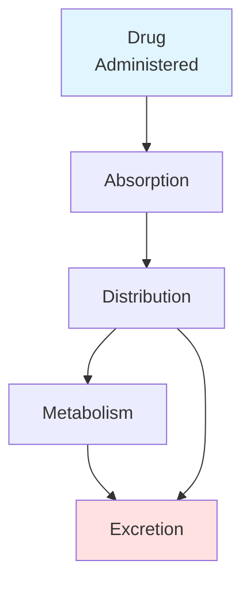
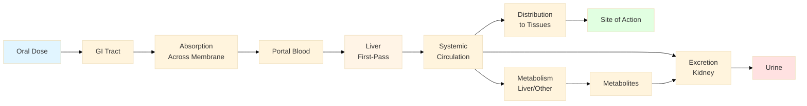
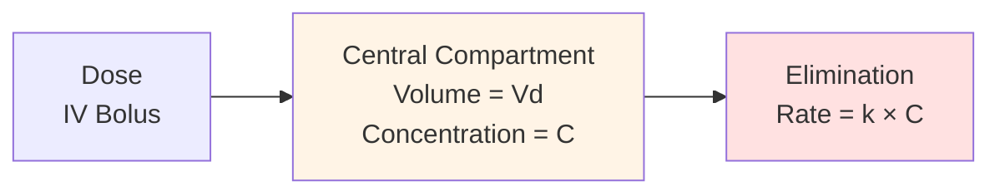
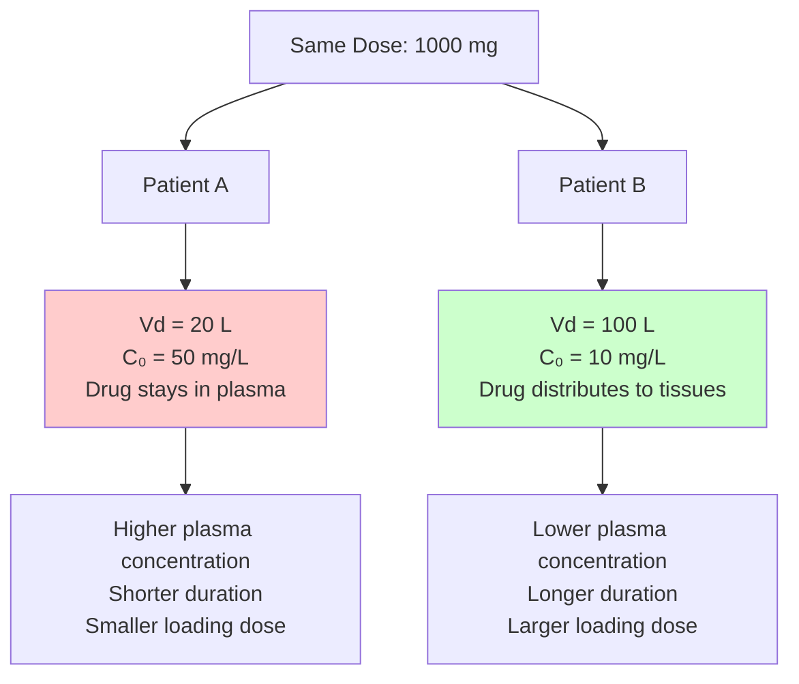
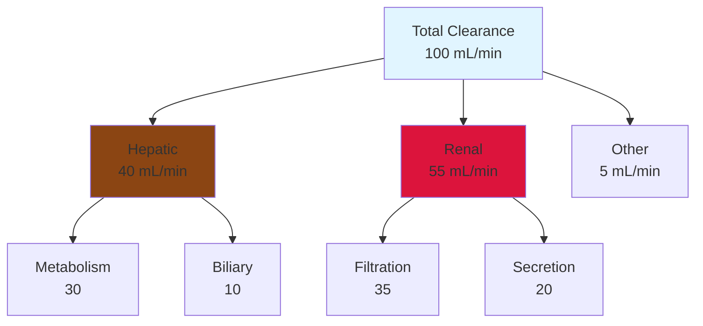
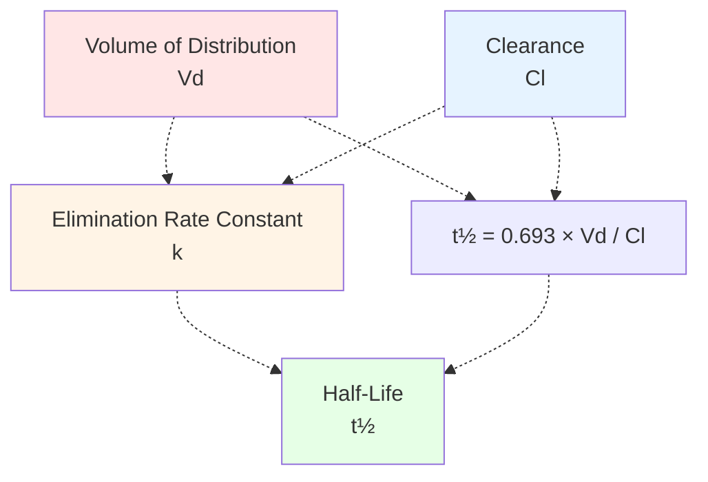
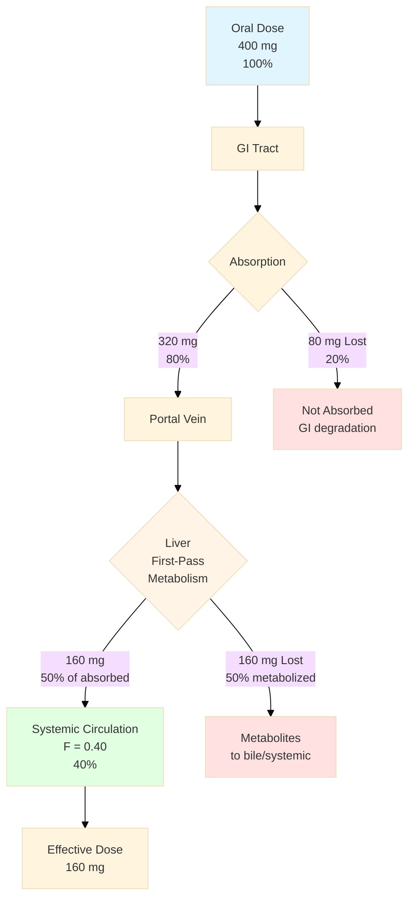
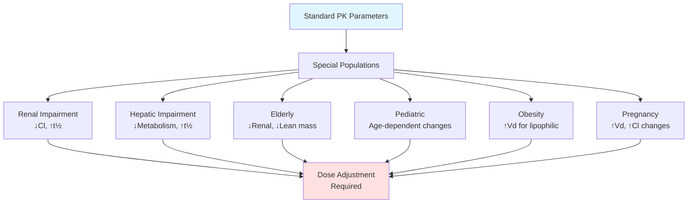
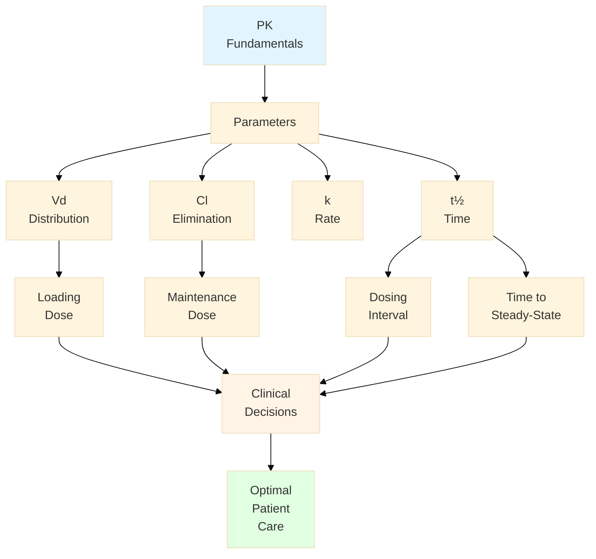

# Introduction to Pharmacokinetics
## What the Body Does to the Drug

<split even>

**Based on Boomer.org PHAR 7632 Syllabus**

Created for introductory pharmacology students

</split>

---

## Learning Objectives

By the end of this lecture, you will be able to:

<!-- .element: class="fragment" -->
- Define pharmacokinetics and explain its clinical importance

<!-- .element: class="fragment" -->
- Describe the four ADME processes

<!-- .element: class="fragment" -->
- Understand and calculate basic PK parameters (Vd, Cl, t½)

<!-- .element: class="fragment" -->
- Interpret a concentration-time curve

<!-- .element: class="fragment" -->
- Distinguish between first-order and zero-order kinetics

<!-- .element: class="fragment" -->
- Explain the concept of bioavailability

note:
Set expectations for what students will learn
These are foundational concepts for clinical practice
Reference: Boomer.org Chapter 3

---

<!-- .slide: data-background="#1a5490" -->
# PART 1
## Fundamentals

---

## What is Pharmacokinetics?

<split even>

**Definition:**
Study of drug movement through the body over time

**Clinical Importance:**
- Dosing regimen design
- Predicting drug concentrations
- Individualizing therapy
- Understanding drug interactions

|||



</split>

note:
Contrast with pharmacodynamics (what drug does to body)
Example: Why does aspirin work for 4-6 hours?
Why do some drugs require loading doses?

---

## ADME: The Four Fundamental Processes

| Process | Definition | Key Factors |
|---------|-----------|-------------|
| **A**bsorption | Drug enters bloodstream | Route, formulation, GI pH |
| **D**istribution | Drug disperses through body | Blood flow, Vd, binding |
| **M**etabolism | Drug chemically transformed | Liver function, enzymes |
| **E**xcretion | Drug removed from body | Renal function, biliary |

<br>

<!-- .element: class="fragment" -->
💡 **Question:** Which process is bypassed with IV administration?

<!-- .element: class="fragment" -->
**Answer:** Absorption!

note:
Each process affects drug concentration over time
These processes often occur simultaneously
IV administration bypasses absorption

---

## ADME Detailed Flow



note:
This shows the complete journey of an oral drug
Notice first-pass metabolism before systemic circulation
IV drugs skip steps A-E and go directly to F

---

## The Concentration-Time Relationship

<split even>

**Key Concept:**
- Drug effect relates to concentration at site of action
- We measure plasma concentration as surrogate
- Concentration changes over time due to ADME

**Important Parameters:**
- **Cmax:** Peak concentration
- **Tmax:** Time to peak
- **AUC:** Area under curve (total exposure)

|||

**Typical Oral Drug Curve:**

```
Conc (mg/L)
   │
15 │     ╱╲
   │    ╱  ╲
10 │   ╱    ╲___
   │  ╱         ╲___
 5 │ ╱              ╲___
   │╱                   ╲___
 0 └──────────────────────────
   0   4   8   12  16  20  24
        Time (hours)

        ↑
      Tmax
```

</split>

note:
This curve tells the "story" of the drug in the body
Shape varies by route of administration
AUC represents total drug exposure

---

<!-- .slide: data-background="#2874a6" -->
# PART 2
## Compartment Models & IV Bolus

---

## Introduction to Compartment Models

<split even>

**Compartment:** Theoretical space where drug distributes uniformly

**One-Compartment Model:**
- Simplest case
- Assumes instantaneous distribution
- Drug behaves as if in single homogeneous space
- Mathematical model, not anatomical

**Useful for:**
- Drugs with rapid distribution
- Initial understanding of PK
- Examples: Aminoglycosides

|||



**Elimination Rate:**
Rate = k × C

where k = elimination rate constant

</split>

note:
This is a mathematical model, not anatomical
Useful for many drugs despite simplification
Reference: Boomer.org Chapter 4

---

## IV Bolus - Simplest Administration

**IV Bolus:** Entire dose given instantly into bloodstream

**Advantages for learning:**
- Absorption = 100% (bypasses absorption)
- Allows focus on distribution and elimination
- Simplest PK scenario

**First-Order Elimination Equation:**

$$C(t) = C_0 \cdot e^{-k \cdot t}$$

Where:
- $C(t)$ = concentration at time t
- $C_0$ = initial concentration
- $k$ = elimination rate constant
- $t$ = time

note:
This exponential equation describes first-order elimination
Most drugs follow first-order kinetics
The equation shows concentration decays exponentially

---

## IV Bolus: Exponential Decay Visualization

```
Concentration (mg/L)
    │
100 │●
    │ ╲
 75 │  ╲
    │   ╲___
 50 │───────●  (1 t½)
    │        ╲___
 25 │────────────●  (2 t½)
    │             ╲___
12.5│──────────────────●  (3 t½)
    │                   ╲___
    └─────────────────────────
    0    5   10   15   20   25
            Time (hours)
```

**Key Points:**
- Exponential decay (curved line)
- Each half-life = 50% reduction
- Never reaches exactly zero (approaches asymptotically)

---

## KEY PARAMETER 1: Volume of Distribution (Vd)

**Definition:** Theoretical volume needed to account for all drug in the body at the same concentration as plasma

$$V_d = \frac{Dose}{C_0}$$

<br>

| Vd Range | Interpretation | Example |
|----------|----------------|---------|
| 5-15 L | Confined to plasma | Warfarin (~8 L) |
| 15-50 L | Extracellular fluid | Many antibiotics |
| >50 L | Extensive tissue distribution | Digoxin (~500 L) |
| >1000 L | Very high tissue binding | Amiodarone (~5000 L) |

<!-- .element: class="fragment" -->
💡 **Vd > total body water (~42 L)** means extensive tissue binding!

note:
Vd is apparent/theoretical, not a real anatomical volume
Affects loading dose calculations
Body water: Plasma 3L, Blood 5L, ECF 14L, TBW 42L

---

## Vd Concept Visualization



**Clinical Significance:**
- Patient B needs 5× larger loading dose to achieve same C₀
- Patient B drug will last longer (if Cl is same)

---

## Practice Problem: Vd Calculation

**Question:**
A patient receives 1000 mg of drug X via IV bolus. The initial plasma concentration (C₀) is measured at 20 mg/L.

**Calculate the volume of distribution.**

<!-- .element: class="fragment" -->

**Solution:**

<!-- .element: class="fragment" -->
$$V_d = \frac{Dose}{C_0} = \frac{1000 \text{ mg}}{20 \text{ mg/L}} = 50 \text{ L}$$

<!-- .element: class="fragment" -->

**Interpretation:** This drug distributes beyond plasma into extracellular fluid and tissues.

---

## KEY PARAMETER 2: Clearance (Cl)

**Definition:** Volume of plasma completely cleared of drug per unit time

**Formulas:**

$$Cl = k \times V_d$$

$$Cl = \frac{Dose}{AUC}$$

**Components:**

$$Cl_{total} = Cl_{hepatic} + Cl_{renal} + Cl_{other}$$

**Units:** mL/min or L/h

note:
Clearance is a measure of elimination efficiency
Independent of dose for first-order kinetics
Determines maintenance dose

---

## Clearance Mechanisms

<split even>

**Organ Systems:**

**Hepatic Clearance:**
- Metabolism (Phase I, Phase II)
- Biliary excretion
- Affected by liver disease
- Typical hepatic blood flow: ~1500 mL/min

**Renal Clearance:**
- Glomerular filtration (~125 mL/min)
- Tubular secretion
- Tubular reabsorption
- Affected by kidney disease
- Typical renal blood flow: ~1200 mL/min

**Other Routes:**
- Pulmonary (volatile agents)
- Salivary (minimal)

|||



</split>

note:
Total clearance is sum of all routes
Organ dysfunction reduces respective clearance
Must adjust doses in liver/kidney disease

---

## Clinical Significance of Clearance

**Determines Maintenance Dose:**

For IV infusion at steady-state:

$$C_{ss} = \frac{R_0}{Cl}$$

Rearranged:

$$R_0 = C_{ss} \times Cl$$

**Clinical Implications:**

<!-- .element: class="fragment" -->
- ↓ Clearance → ↓ Maintenance dose needed
<!-- .element: class="fragment" -->
- Renal impairment → Reduce dose of renally cleared drugs
<!-- .element: class="fragment" -->
- Hepatic impairment → Reduce dose of hepatically cleared drugs
<!-- .element: class="fragment" -->
- Drug interactions can ↑ or ↓ clearance

---

## KEY PARAMETER 3: Half-Life (t½)

**Definition:** Time required for plasma concentration to decrease by 50%

**Formulas:**

$$t_{1/2} = \frac{0.693}{k}$$

$$t_{1/2} = \frac{0.693 \times V_d}{Cl}$$

**The "5 Half-Lives" Rule:**
- Time to **steady-state** ≈ 5 × t½ (97% complete)
- Time to **eliminate** ≈ 5 × t½ (97% eliminated)

note:
Half-life determines dosing interval
Independent of dose for first-order kinetics
Depends on BOTH Vd and Cl

---

## Half-Life: Step-by-Step Decay

| Time | Fraction Remaining | % Remaining | Fraction Eliminated | % Eliminated |
|------|-------------------|-------------|---------------------|--------------|
| 0 | 1 | 100% | 0 | 0% |
| 1 t½ | 1/2 | 50.0% | 1/2 | 50.0% |
| 2 t½ | 1/4 | 25.0% | 3/4 | 75.0% |
| 3 t½ | 1/8 | 12.5% | 7/8 | 87.5% |
| 4 t½ | 1/16 | 6.25% | 15/16 | 93.75% |
| 5 t½ | 1/32 | 3.125% | 31/32 | 96.875% |

<br>

<!-- .element: class="fragment" -->
**Example:** If C₀ = 100 mg/L and t½ = 4 hours:
- At 4h: C = 50 mg/L
- At 8h: C = 25 mg/L
- At 12h: C = 12.5 mg/L

---

## Practice Problem: Half-Life Calculation

**Question:**
A drug has Vd = 35 L and Cl = 3.5 L/h.

Calculate:
a) Elimination rate constant (k)
b) Half-life (t½)

<!-- .element: class="fragment" -->

**Solution:**

<!-- .element: class="fragment" -->
**a) Calculate k:**

<!-- .element: class="fragment" -->
$$k = \frac{Cl}{V_d} = \frac{3.5 \text{ L/h}}{35 \text{ L}} = 0.1 \text{ h}^{-1}$$

<!-- .element: class="fragment" -->
**b) Calculate t½:**

<!-- .element: class="fragment" -->
$$t_{1/2} = \frac{0.693}{k} = \frac{0.693}{0.1 \text{ h}^{-1}} = 6.93 \text{ hours}$$

---

## Relating Vd, Cl, k, and t½



**Key Insights:**
- ↑ Vd → ↑ t½ (more drug in tissues takes longer to eliminate)
- ↑ Cl → ↓ t½ (faster elimination = shorter half-life)
- k connects Vd and Cl
- All four parameters are interdependent!

---

## First-Order vs Zero-Order Kinetics

<split even>

**First-Order (Most Common):**

✓ Constant **fraction** eliminated per time
✓ Exponential decay
✓ t½ is **constant**
✓ Rate = k × C (concentration-dependent)
✓ Linear on semi-log plot

**Examples:**
- Most drugs at therapeutic doses
- Aminoglycosides, digoxin, warfarin

|||

**Zero-Order (Rare):**

✓ Constant **amount** eliminated per time
✓ Linear decay
✓ t½ **changes** with concentration
✓ Rate = constant (saturable)
✓ Linear on regular plot

**Examples:**
- Ethanol (at moderate-high doses)
- Phenytoin (at therapeutic doses)
- Aspirin (high doses)
- Heparin

</split>

note:
Zero-order occurs when elimination mechanisms saturated
Clinical importance: Small dose changes can cause large concentration changes
Reference: Boomer.org Chapter 22

---

## First-Order vs Zero-Order: Visual Comparison

**Regular Plot:**

```
Concentration (mg/L)
    │
100 │●╲                    ●────
    │  ╲                    ╲
 75 │   ╲___                 ╲
    │       ╲___              ╲
 50 │           ╲___           ╲
    │               ╲___        ╲
 25 │                   ╲___     ╲
    │                       ╲___  ╲
  0 └──────────────────────────────●
    0   2   4   6   8  10  12  14
            Time (hours)

    ───── First-Order (curved)
    ━━━━━ Zero-Order (straight)
```

**Key Difference:**
- **First-order:** Never reaches zero (asymptotic)
- **Zero-order:** Reaches zero at specific time

---

## Clinical Implications of Kinetic Order

**First-Order Kinetics:**
- Predictable dosing
- t½ constant regardless of dose
- Doubling dose → doubles steady-state concentration
- Safe dose adjustments

**Zero-Order Kinetics:**
- ⚠️ **Dangerous!** Unpredictable at high doses
- Small dose increase can cause large ↑ in concentration
- Risk of toxicity
- Requires careful monitoring

**Example: Phenytoin**
- Therapeutic range: 10-20 mg/L
- Increasing dose from 300 mg/day to 400 mg/day can cause concentration to jump from 15 to 30 mg/L!
- Requires therapeutic drug monitoring

---

<!-- .slide: data-background="#28a745" -->
# PART 3
## IV Infusion & Steady State

---

## Continuous IV Infusion

<split even>

**Concept:**
- Drug administered at constant rate (R₀)
- Accumulation until steady-state
- **Input rate = Elimination rate** at steady-state

**Formula:**

$$C_{ss} = \frac{R_0}{Cl}$$

**Reaching Steady-State:**
- 50% at 1 × t½
- 75% at 2 × t½
- 87.5% at 3 × t½
- **97% at 5 × t½**

|||

**Rise to Steady-State Curve:**

```
C (mg/L)
    │
 15 │─────────────────────●
    │              ╱─────
    │          ╱───
 10 │      ╱───
    │   ╱──
  5 │╱──
    │
  0 └──────────────────────────
    0   t½  2t½ 3t½ 4t½ 5t½

    Infusion started ↑
    Steady-state reached →
```

</split>

note:
Used for drugs needing constant levels
Examples: dopamine, heparin, propofol
Reference: Boomer.org Chapter 6

---

## Steady-State Principles

**At Steady-State:**

Rate of drug **IN** = Rate of drug **OUT**

$$R_0 = Cl \times C_{ss}$$

**Before Steady-State:**
- Drug accumulates
- Concentration rising
- Rate IN > Rate OUT

**After Stopping Infusion:**
- Drug eliminates
- Concentration falling
- Takes ~5 × t½ to eliminate 97%

---

## Loading Dose Concept

**Problem:** Takes 5 × t½ to reach steady-state. What if we need therapeutic levels **immediately**?

**Solution:** Loading Dose!

$$Loading\ Dose = V_d \times C_{target}$$

**Example:**
- Drug with t½ = 24 hours
- Would take **5 days** to reach steady-state without loading dose
- Loading dose achieves therapeutic level immediately
- Maintenance infusion maintains it

<!-- .element: class="fragment" -->
**Risk:** ⚠️ Toxicity if Vd estimated incorrectly!

note:
Common for digoxin, phenytoin, some antibiotics
Loading dose = "jumpstart" to therapeutic level

---

## With vs Without Loading Dose

```
C (mg/L)
    │
 12 │●────────────────────────
    │                  ╱─────
    │               ╱──
  8 │            ╱──
    │         ╱──
  4 │      ╱──
    │   ╱──
  0 └──────────────────────────
    0     24    48    72    96
            Time (hours)

    ● = With loading dose (immediate)
    ╱ = Without loading dose (gradual)
```

**Time Saved:** ~4 days to reach therapeutic level!

**Clinical Uses:**
- Digoxin (t½ = 40 hours)
- Phenytoin (t½ = 12-36 hours)
- Vancomycin (in some protocols)

---

<!-- .slide: data-background="#ffc107" -->
# PART 4
## Oral Administration & Bioavailability

---

## Oral Administration - A Different Story

**Differences from IV:**

| Aspect | IV | Oral |
|--------|-----|------|
| Absorption | Not needed (100%) | Required |
| First-pass | None | Yes (liver) |
| Cmax | = C₀ (immediate) | < C₀ (delayed) |
| Tmax | 0 (instant) | Variable (0.5-6 h) |
| Bioavailability (F) | 1.0 (100%) | Variable (<1.0) |

**ADME for Oral:**
- ✅ **A**bsorption - CRITICAL step
- ✅ **D**istribution - same as IV after absorption
- ✅ **M**etabolism - occurs BEFORE and AFTER reaching systemic circulation
- ✅ **E**xcretion - same as IV

---

## IV vs Oral Concentration-Time Curves

```
Concentration (mg/L)
    │
 10 │●                  Same dose
    │ ╲
  8 │  ╲              (100 mg)
    │   ╲
  6 │    ╲___      ╱●╲
    │        ╲__╱──   ╲__
  4 │          ●        ╲__
    │                      ╲__
  2 │                         ●
    │
  0 └─────────────────────────────
    0   2   4   6   8  10  12  14
            Time (hours)

    ● = IV (C₀ = 10 mg/L)
    ● = Oral (Cmax = 6 mg/L, Tmax = 4h)
```

**Key Observations:**
- Oral has absorption phase (↑ concentration)
- Oral Cmax < IV C₀ (due to F < 1.0 and gradual absorption)
- Oral has Tmax (time to peak)
- AUC_oral < AUC_IV (if F < 1.0)

---

## Bioavailability (F)

**Definition:** Fraction of administered dose that reaches systemic circulation **unchanged**

$$F = \frac{AUC_{oral} \times Dose_{IV}}{AUC_{IV} \times Dose_{oral}}$$

**Range:** 0 to 1 (or 0% to 100%)

**For IV:** F = 1.0 (100%) by definition

**Factors Reducing F:**
- 🔴 First-pass hepatic metabolism (MAJOR)
- 🔴 Incomplete absorption from GI tract
- 🔴 Drug degradation in GI (acid, enzymes)
- 🔴 Efflux transporters (P-glycoprotein)
- 🔴 Food effects

---

## Clinical Examples of Bioavailability

| Drug | Oral F | Reason for Low F |
|------|--------|------------------|
| **IV formulations** | 100% | Direct to circulation |
| **Amoxicillin** | ~80% | Good absorption, minimal first-pass |
| **Gabapentin** | ~60% | Saturable absorption |
| **Morphine** | ~25% | Extensive first-pass metabolism |
| **Verapamil** | ~20% | High first-pass metabolism |
| **Cyclosporine** | 10-50% | Variable absorption, P-gp efflux |
| **Nitroglycerin** | <1% | Almost complete first-pass |

**Dose Adjustment Needed:**

$$Dose_{oral} = \frac{Dose_{IV}}{F}$$

**Example:** If morphine F = 0.25 and IV dose = 10 mg, then oral dose = 10 / 0.25 = **40 mg**

---

## First-Pass Metabolism Flow



**Result:** Only 160 mg (40%) of 400 mg oral dose reaches systemic circulation!

---

## Practice Problem: Bioavailability

**Question:**
A patient receives 100 mg IV and achieves AUC = 50 mg·h/L. The same patient receives 200 mg orally and achieves AUC = 60 mg·h/L.

Calculate the bioavailability (F) of the oral formulation.

<!-- .element: class="fragment" -->

**Solution:**

<!-- .element: class="fragment" -->
$$F = \frac{AUC_{oral} \times Dose_{IV}}{AUC_{IV} \times Dose_{oral}}$$

<!-- .element: class="fragment" -->
$$F = \frac{60 \text{ mg·h/L} \times 100 \text{ mg}}{50 \text{ mg·h/L} \times 200 \text{ mg}}$$

<!-- .element: class="fragment" -->
$$F = \frac{6000}{10000} = 0.6 = 60\%$$

<!-- .element: class="fragment" -->
**Interpretation:** Only 60% of oral dose reaches systemic circulation. 40% lost to incomplete absorption and/or first-pass metabolism.

---

## Bioequivalence

**Definition:** Two formulations are bioequivalent if they deliver same amount of drug to circulation at same rate

**FDA Criteria:**
- Same **AUC** (extent of absorption) ± 20%
- Same **Cmax** and **Tmax** (rate of absorption) ± 20%
- 90% confidence interval: 80-125% ratio

**Clinical Importance:**
- Generic vs brand-name drugs
- Changing formulations
- Ensuring therapeutic equivalence

**Not Bioequivalent:**
- Different salt forms
- Different routes (oral vs IM)
- Immediate-release vs extended-release

---

<!-- .slide: data-background="#dc3545" -->
# PART 5
## Clinical Applications

---

## Clinical Case: Gentamicin Dosing

**Patient:** 70 kg adult with pneumonia

**Drug:** Gentamicin (aminoglycoside antibiotic)

**Known Parameters:**
- Vd = 0.25 L/kg
- t½ = 2.3 hours
- Target Css = 5 mg/L

**Tasks:**
1. Calculate infusion rate for steady-state
2. Calculate loading dose
3. Determine time to steady-state without loading

---

## Gentamicin Case: Solution

**Step 1: Calculate total Vd**

$$V_d = 0.25 \text{ L/kg} \times 70 \text{ kg} = 17.5 \text{ L}$$

**Step 2: Calculate k and Cl**

$$k = \frac{0.693}{2.3 \text{ h}} = 0.301 \text{ h}^{-1}$$

$$Cl = k \times V_d = 0.301 \times 17.5 = 5.27 \text{ L/h}$$

**Step 3: Calculate infusion rate**

$$R_0 = C_{ss} \times Cl = 5 \text{ mg/L} \times 5.27 \text{ L/h} = 26.4 \text{ mg/h}$$

---

## Gentamicin Case: Results

**Answers:**

1. **Infusion rate:** 26.4 mg/h ≈ **26-27 mg/h**

2. **Loading dose:**
   $$LD = V_d \times C_{target} = 17.5 \text{ L} \times 5 \text{ mg/L} = 87.5 \text{ mg}$$
   ≈ **85-90 mg**

3. **Time to steady-state:**
   $$5 \times t_{1/2} = 5 \times 2.3 \text{ h} = 11.5 \text{ hours}$$

**Clinical Decision:**
- Give 85-90 mg loading dose
- Follow with 26-27 mg/h infusion
- Loading dose saves ~11.5 hours!

---

## Special Populations: Overview



---

## Renal Impairment

**Changes in PK:**
- ↓ **Clearance** (for renally eliminated drugs)
- ↑ **Half-life**
- Vd usually unchanged
- Need **dose reduction**

**Dose Adjustment:**

$$Dose_{new} = Dose_{normal} \times \frac{CrCl_{patient}}{CrCl_{normal}}$$

**Or:** Extend dosing interval proportionally

**Examples Requiring Adjustment:**
- Aminoglycosides (gentamicin, tobramycin) - **CRITICAL**
- Vancomycin - **CRITICAL**
- Many beta-lactams
- Gabapentin
- Enoxaparin

note:
CrCl = Creatinine clearance
Normal CrCl ≈ 100-120 mL/min
Use Cockcroft-Gault equation

---

## Hepatic Impairment

**Changes in PK:**
- ↓ **Metabolism** (Phase I and/or Phase II)
- ↓ **Clearance**
- ↑ **Half-life**
- Possibly ↓ protein binding (low albumin)

**Approach:**
- No simple formula like renal
- Use Child-Pugh score (A, B, C)
- Generally reduce dose by 25-50%
- Monitor closely

**Examples Requiring Adjustment:**
- Warfarin
- Benzodiazepines (most)
- Opioids
- Propranolol
- Phenytoin

---

## Elderly Patients

**Age-Related Changes:**

| System | Change | Impact |
|--------|--------|--------|
| Renal | ↓ GFR (even if SCr normal) | ↑ t½ for renally cleared drugs |
| Body composition | ↓ Lean mass, ↑ Fat % | ↑ Vd for lipophilic drugs |
| Liver | ↓ Blood flow, ↓ mass | ↓ Metabolism |
| Albumin | ↓ Levels | ↑ Free drug concentration |
| Receptor sensitivity | Variable changes | Enhanced/reduced effects |

**General Approach:**
- **"Start low, go slow"**
- Use lower end of dosing range
- Monitor for adverse effects
- Calculate CrCl (don't rely on SCr alone!)
- Consider polypharmacy interactions

---

## Obesity

**Dosing Weight Considerations:**

| Parameter | Weight to Use | Example Drugs |
|-----------|---------------|---------------|
| **Hydrophilic drugs (small Vd)** | Ideal Body Weight (IBW) | Aminoglycosides |
| **Lipophilic drugs (large Vd)** | Total Body Weight (TBW) | Propofol, benzodiazepines |
| **Compromise** | Adjusted Body Weight (ABW) | Vancomycin |

**Formulas:**

$$IBW_{male} = 50 + 2.3 \times (height_{inches} - 60)$$

$$IBW_{female} = 45.5 + 2.3 \times (height_{inches} - 60)$$

$$ABW = IBW + 0.4 \times (TBW - IBW)$$

---

<!-- .slide: data-background="#17a2b8" -->
# Summary & Key Concepts

---

## Key Concepts Summary

**What We Covered:**

✅ **Pharmacokinetics** = what body does to drug

✅ **ADME** processes (Absorption, Distribution, Metabolism, Excretion)

✅ **Three critical parameters:**
- **Vd** - Volume of distribution → determines loading dose
- **Cl** - Clearance → determines maintenance dose
- **t½** - Half-life → determines dosing interval

✅ **First-order kinetics** (exponential decay) - most common

✅ **IV infusion** and steady-state (5 × t½ rule)

✅ **Bioavailability** for oral drugs (F)

---

## Essential Formulas - Quick Reference

**Basic Parameters:**

$$V_d = \frac{Dose}{C_0}$$

$$Cl = k \times V_d = \frac{Dose}{AUC}$$

$$k = \frac{Cl}{V_d} = \frac{0.693}{t_{1/2}}$$

$$t_{1/2} = \frac{0.693}{k} = \frac{0.693 \times V_d}{Cl}$$

---

## Essential Formulas - Clinical Applications

**Concentration After IV Bolus:**

$$C(t) = C_0 \times e^{-k \times t}$$

**Steady-State (IV Infusion):**

$$C_{ss} = \frac{R_0}{Cl}$$

**Loading Dose:**

$$LD = V_d \times C_{target}$$

**Bioavailability:**

$$F = \frac{AUC_{oral} \times Dose_{IV}}{AUC_{IV} \times Dose_{oral}}$$

---

## The Relationships Map



---

## Key Principles to Remember

1. **Most drugs follow first-order kinetics**
   - Constant fraction eliminated per time
   - t½ is constant

2. **Steady-state takes ~5 half-lives**
   - To reach: 5 × t½
   - To eliminate: 5 × t½

3. **Clearance determines maintenance dose**
   - ↓ Cl → ↓ Dose needed

4. **Vd determines loading dose**
   - ↑ Vd → ↑ Loading dose needed

5. **Half-life determines dosing interval**
   - Long t½ → Less frequent dosing

---

## Clinical Pearls

⚠️ **Narrow Therapeutic Index Drugs** - Monitor carefully:
- Warfarin, Digoxin, Lithium, Phenytoin, Theophylline, Aminoglycosides

⚠️ **Saturable Kinetics** - Can switch to zero-order:
- Phenytoin, Aspirin (high dose), Ethanol

⚠️ **Highly Protein Bound** - Drug interactions:
- Warfarin (99%), Phenytoin (90%), Valproic acid (90%)

⚠️ **Renally Eliminated** - Adjust in kidney disease:
- Aminoglycosides, Vancomycin, Gabapentin, Lithium

⚠️ **Hepatically Eliminated** - Adjust in liver disease:
- Benzodiazepines, Warfarin, Phenytoin

---

## What's Next? Advanced Topics

**Build on this foundation:**

1. **Multiple compartment models** (2, 3+ compartments)
2. **Multiple dosing and accumulation** (repeated doses)
3. **Non-linear kinetics** (Michaelis-Menten)
4. **Therapeutic drug monitoring** (TDM strategies)
5. **Population pharmacokinetics** (variability, covariates)
6. **PK/PD modeling** (linking concentration to effect)

---

## Practice Problem Set

**Problem 1:**
Drug with Cl = 50 mL/min. What infusion rate achieves Css = 10 mg/L?

**Problem 2:**
If F = 0.5 and you need 200 mg systemically, what oral dose?

**Problem 3:**
1000 mg IV bolus → C₀ = 25 mg/L, t½ = 6 hours
Calculate: a) Vd, b) k, c) C at 12 hours

<!-- .element: class="fragment" -->

**Answers:**
1. 30 mg/h
2. 400 mg
3. a) 40 L, b) 0.116 h⁻¹, c) 6.25 mg/L

---

## Resources & Further Learning

**Boomer.org Chapters:**

📖 [Chapter 3: Fundamentals](https://www.boomer.org/c/p4/c03/c03.htm)

📖 [Chapter 4: One-Compartment IV](https://www.boomer.org/c/p4/c04/c04.htm)

📖 [Chapter 5: Parameters](https://www.boomer.org/c/p4/c05/c05.htm)

📖 [Chapter 6: IV Infusion](https://www.boomer.org/c/p4/c06/c06.htm)

📖 [Chapters 7-8: Oral](https://www.boomer.org/c/p4/)

📖 [Full Syllabus](https://www.boomer.org/c/p4/syllabus.html)

---

## Additional Resources

**Open Educational Resources:**

- **NCBI Bookshelf:** Free pharmacology textbooks
- **StatPearls:** Comprehensive medical reference
- **Deranged Physiology:** Excellent PK explanations
- **ABC of PK/PD:** Open textbook (Alberta)

**Reference Texts:**

- Rowland & Tozer: "Clinical Pharmacokinetics & Pharmacodynamics"
- Winter: "Basic Clinical Pharmacokinetics"
- Shargel & Yu: "Applied Biopharmaceutics & Pharmacokinetics"

**Interactive Tools:**

- Boomer.org calculators
- RxKinetics PK simulator

---

<!-- .slide: data-background="#1a5490" -->

# Questions?

<br>

## Thank You!

<br>

**Remember:** Pharmacokinetics is the foundation for rational drug therapy.

Understanding these principles will make you a better clinician!

---

## Bonus: Quick Reference Card

```
┌─────────────────────────────────────────┐
│    PHARMACOKINETICS FORMULA CARD        │
├─────────────────────────────────────────┤
│ Vd = Dose / C₀                         │
│                                         │
│ Cl = k × Vd = Dose / AUC               │
│                                         │
│ k = Cl / Vd = 0.693 / t½               │
│                                         │
│ t½ = 0.693 / k = (0.693×Vd) / Cl      │
│                                         │
│ C(t) = C₀ × e^(-k×t)                  │
│                                         │
│ Css = R₀ / Cl                          │
│                                         │
│ Loading Dose = Vd × Ctarget            │
│                                         │
│ F = (AUCoral×DoseIV)/(AUCIV×Doseoral) │
│                                         │
│ Time to Steady-State ≈ 5 × t½         │
└─────────────────────────────────────────┘
```

---

## Contact & Feedback

**Course Information:**
- Office hours: [Time and location]
- Email: [Your email]
- Course website: [URL]

**Additional Materials:**
- Practice problem sets
- Detailed solutions
- Quick reference guide
- Clinical case studies

**Feedback Welcome!**

Please share your thoughts on this lecture to help improve future sessions.

---

<!-- .slide: data-background="#e1f5ff" -->

## End of Presentation

### Good luck with your pharmacokinetics studies!

**Next Steps:**
1. Review practice problems
2. Read Boomer.org Chapters 3-8
3. Work through calculations
4. Apply to clinical cases

**Study Tips:**
- Draw concentration-time curves
- Practice calculations daily
- Relate concepts to real drugs
- Ask questions early and often!
